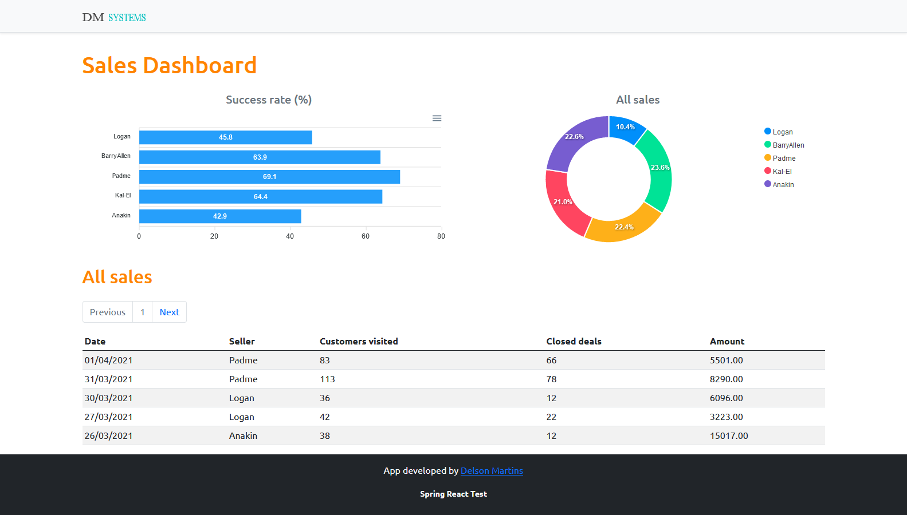

# Sales Dashboard
Project developed with Java Spring Boot and React.JS





# Backend  


Project created using [Spring Boot](http://projects.spring.io/spring-boot/).

### Requirements

For building and running the application you need:

- [JDK 1.8](http://www.oracle.com/technetwork/java/javase/downloads/jdk8-downloads-2133151.html)
- [Maven 3](https://maven.apache.org)

### Project settings

- pom.xml created by [Spring Initializr](https://start.spring.io/) with the following dependencies:
  - Web
  - JPA
  - H2
  - Postgres
  - Security


### Running the application locally

There are several ways to run a Spring Boot application on your local machine. One way is to execute the `main` method in the `svendasApplication` class from your IDE.

Alternatively you can use the [Spring Boot Maven plugin](https://docs.spring.io/spring-boot/docs/current/reference/html/build-tool-plugins-maven-plugin.html) like so:

```shell
# Run the application
$ mvnw spring-boot:run

# Build for deploy
$ mvnw clean package
```
<br>
<br>

# Frontend 

Project was bootstrapped with [Create React App](https://github.com/facebook/create-react-app).

### Requirements
- Installing Yarn
```bash
yarn -v
npm install --global yarn
```


- Bootstrap
```
yarn add bootstrap
```
- Apex Charts
```bash
yarn add apexcharts
yarn add react-apexcharts
```
- Axios
```bash
yarn add axios
```
- React Router DOM
```bash
yarn add react-router-dom

yarn add @types/react-router-dom -D
```
- date-fns
```bash
yarn add date-fns
```
### Running the application locally
```bash
yarn start
```

Runs the app in the development mode. Open [http://localhost:3000](http://localhost:3000) to view it in the browser. The page will reload if you make edits.


### Building for deploy
```bash
yarn build
```
Builds the app for production to the `build` folder. It correctly bundles React in production mode and optimizes the build for the best performance.


